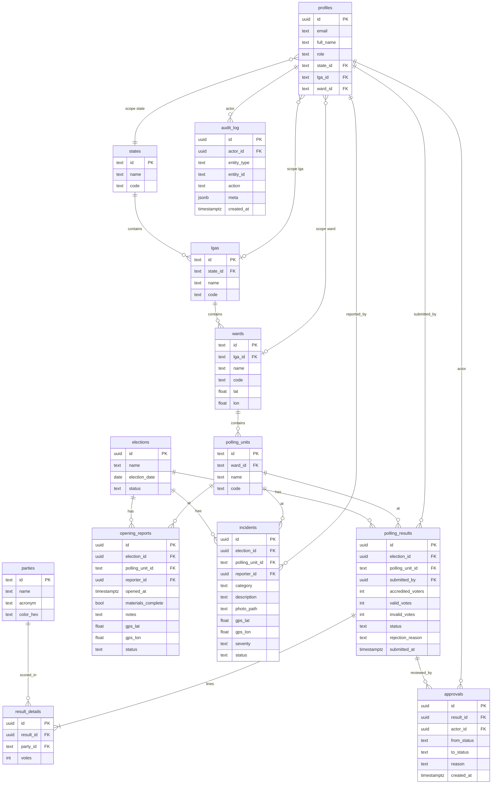

# CB-EMR Entity-Relationship Diagram

```mermaid
erDiagram
  states ||--o{ lgas : contains
  lgas ||--o{ wards : contains
  wards ||--o{ polling_units : contains

  profiles }o--|| states : "scope state"
  profiles }o--o| lgas : "scope lga"
  profiles }o--o| wards : "scope ward"

  elections ||--o{ polling_results : has
  elections ||--o{ opening_reports : has
  elections ||--o{ incidents : has

  parties ||--o{ result_details : scored_in
  polling_units ||--o{ polling_results : at
  polling_units ||--o{ opening_reports : at
  polling_units ||--o{ incidents : at

  polling_results ||--|{ result_details : lines
  polling_results ||--o{ approvals : reviewed_by
  profiles ||--o{ approvals : actor
  profiles ||--o{ polling_results : submitted_by
  profiles ||--o{ incidents : reported_by
  profiles ||--o{ audit_log : actor

  states {
    text id PK
    text name
    text code
  }
  lgas {
    text id PK
    text state_id FK
    text name
    text code
  }
  wards {
    text id PK
    text lga_id FK
    text name
    text code
    float lat
    float lon
  }
  polling_units {
    text id PK
    text ward_id FK
    text name
    text code
  }
  profiles {
    uuid id PK
    text email
    text full_name
    text role
    text state_id FK
    text lga_id FK
    text ward_id FK
  }
  elections {
    uuid id PK
    text name
    date election_date
    text status
  }
  parties {
    text id PK
    text name
    text acronym
    text color_hex
  }
  opening_reports {
    uuid id PK
    uuid election_id FK
    text polling_unit_id FK
    uuid reporter_id FK
    timestamptz opened_at
    bool materials_complete
    text notes
    float gps_lat
    float gps_lon
    text status
  }
  polling_results {
    uuid id PK
    uuid election_id FK
    text polling_unit_id FK
    uuid submitted_by FK
    int accredited_voters
    int valid_votes
    int invalid_votes
    text status
    text rejection_reason
    timestamptz submitted_at
  }
  result_details {
    uuid id PK
    uuid result_id FK
    text party_id FK
    int votes
  }
  incidents {
    uuid id PK
    uuid election_id FK
    text polling_unit_id FK
    uuid reporter_id FK
    text category
    text description
    text photo_path
    float gps_lat
    float gps_lon
    text severity
    text status
  }
  approvals {
    uuid id PK
    uuid result_id FK
    uuid actor_id FK
    text from_status
    text to_status
    text reason
    timestamptz created_at
  }
  audit_log {
    uuid id PK
    uuid actor_id FK
    text entity_type
    text entity_id
    text action
    jsonb meta
    timestamptz created_at
  }
```

## Status enum (results / opening reports)

`draft` → `pending_ward` → `pending_lga` → `pending_state` → `state_verified` | `rejected`
